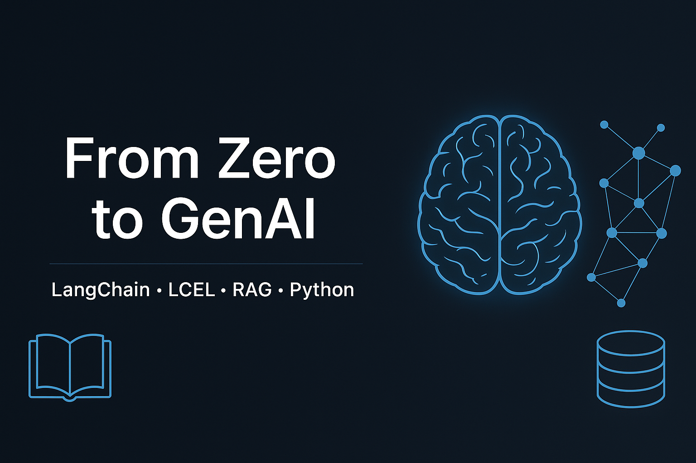

<p align="center">
  
</p>

# 🤖 From Zero to GenAI

> A hands-on journey into the world of Generative AI — from chatbots to LangChain agents, from retrieval to orchestration 🚀

---

## 🌟 What's Inside?

This repository is a curated collection of mini-projects and interactive demos to **learn**, **play**, and **build** with cutting-edge GenAI tools.

> 🧪 Built step by step — live notebooks, real use cases, no fluff.

---

## 📁 Project Structure

Modular folders by topic, each with its own `README.md` and Jupyter notebooks:

- `/basic_chatbots` – foundational chatbot logic
- `/key_extraction` – info extraction and sentiment analysis
- `/rag_components` – step-by-step RAG pipeline
- `/langchain_lcel` – LCEL-based chaining experiments
- `/langchain_apps` – LangServe, LangGraph, LangSmith demos
- `/retriever_apps` – build a retriever from scratch
- `/qa_apps` – question answering from PDFs and SQL

---

## 🧠 Projects Overview

| 📂 Project           | 🔍 Description                                 |
|----------------------|-----------------------------------------------|
| 🤖 `basic_chatbots`  | Simple to advanced chatbot logic              |
| 🔑 `key_extraction`  | Data extraction + sentiment from raw text     |
| 🧩 `rag_components`  | Step-by-step build of a RAG pipeline          |
| 🧪 `langchain_lcel`  | Experiments using LCEL for chaining           |
| ⚙️ `langchain_apps`  | LangServe, LangGraph, LangSmith playground    |
| 🧲 `retriever_apps`  | Build your own retriever app                  |
| 📄 `qa_apps`         | QA from SQL + QA from PDF                     |

---

## 🛠️ Tech Stack

- 🧠 **LangChain**
- 📚 **LLMs** (OpenAI, Gemini…)
- 🧲 **Vector DBs**: Pinecone / FAISS
- 🧰 **Python**, **Jupyter Notebooks**
- ⚙️ Optional: **vLLM**, **LangServe**, **LangGraph**

---

## 🏁 Getting Started

```bash
# Clone the repo
git clone https://github.com/Khaliel21/from-zero-to-genai.git
cd from-zero-to-genai

# (Optional) Create virtual environment
python -m venv venv
source venv/bin/activate  # or venv\Scripts\activate on Windows

# Install dependencies
pip install -r requirements.txt
